<p align="center">
  
</p>

# CosmosRN 🔭

> Showcase app de **astronomía básica** en React Native, construida para demostrar las capacidades del framework usando el cosmos como hilo narrativo.

Cada módulo de la app resuelve un caso de uso astronómico real: rastrear la ISS en tiempo real, explorar el catálogo del sistema solar, recibir alertas de tormentas solares o navegar el cielo estrellado con el giroscopio del dispositivo.

**Plataformas:** Android (prioridad) → Web → iOS

---

## Módulos del showcase

| Módulo | Capacidad RN demostrada | Caso de uso astronómico |
|---|---|---|
| `navigation/` | Stack, Tabs, Drawer — React Navigation v7 | Navegar entre Planetas, ISS, APOD, Eventos |
| `lists/` | FlatList / SectionList — virtualización | Catálogo de planetas, lunas y asteroides |
| `forms/` | react-hook-form + Zod — validación | Búsqueda de asteroides por fecha |
| `animations/` | Reanimated 3 — worklets en UI thread | Órbitas planetarias y rotación 3D |
| `camera/` | expo-camera — acceso a hardware | AR overlay de constelaciones ⚡ |
| `maps/` | react-native-maps + geolocalización | Mapa con posición en tiempo real de la ISS |
| `storage/` | AsyncStorage / MMKV / SQLite | Caché APOD y diario de favoritos |
| `notifications/` | expo-notifications — FCM | Alertas de tormentas solares y paso ISS |
| `sensors/` | expo-sensors — giroscopio / acelerómetro | Mapa estelar controlado por movimiento |
| `auth/` | Supabase Auth + biometría | Diario personal de observaciones |
| `realtime/` | Supabase Realtime subscriptions | Posición ISS broadcast multi-cliente |
| `platform/` | Platform.OS — diferencias nativas | Comparativa Android / Web / iOS |

> ⚡ Stretch goal — opcional en la entrega académica.

---

## Stack

| Capa | Tecnología | Versión |
|---|---|---|
| Runtime | React Native | 0.83.x |
| Framework | Expo SDK | 55.0.15 |
| Lenguaje | TypeScript | 5.x (strict) |
| Navegación | React Navigation | v7.x |
| Animaciones | Reanimated + Gesture Handler | 3.x |
| Estado global | Zustand | pinear al instalar |
| Fetching / caché | TanStack Query | v5.x |
| Formularios | react-hook-form + Zod | pinear al instalar |
| Backend | Supabase (free tier) | — |
| Package manager | pnpm | save-exact=true |

---

## APIs astronómicas

| API | URL base | Auth |
|---|---|---|
| NASA APOD | `https://api.nasa.gov/planetary/apod` | API key gratuita |
| NASA NeoWs | `https://api.nasa.gov/neo/rest/v1` | API key gratuita |
| NASA DONKI | `https://api.nasa.gov/DONKI` | API key gratuita |
| Solar System OpenData | `https://api.le-systeme-solaire.net/rest` | Sin auth |
| Open-Notify ISS | `http://api.open-notify.org/iss-now.json` | Sin auth |
| Open-Notify Astronauts | `http://api.open-notify.org/astros.json` | Sin auth |

---

## Requisitos previos

- [Node.js](https://nodejs.org/) ≥ 20
- [pnpm](https://pnpm.io/) ≥ 9 (`npm install -g pnpm` — única vez)
- [Android Studio](https://developer.android.com/studio) con un AVD configurado (para Android)
- [Expo Go](https://expo.dev/go) en el dispositivo físico (desarrollo rápido)
- Cuenta gratuita en [api.nasa.gov](https://api.nasa.gov/) para obtener la API key
- Proyecto gratuito en [supabase.com](https://supabase.com/) para el backend

---

## Instalación

```bash
# 1. Clonar el repositorio
git clone <url-del-repo>
cd proyecto-reactnative

# 2. Instalar dependencias (NUNCA usar npm ni yarn)
pnpm install

# 3. Configurar variables de entorno
cp .env.example .env
# Editar .env con las claves reales (ver sección Variables de entorno)

# 4. Auditar dependencias antes de ejecutar
pnpm audit --audit-level moderate
```

---

## Variables de entorno

Copiar `.env.example` a `.env` y completar los valores:

```bash
# NASA Open APIs — registrar en https://api.nasa.gov/
EXPO_PUBLIC_NASA_API_KEY=tu_clave_nasa_aqui

# Supabase — obtener en https://supabase.com/dashboard/project/_/settings/api
EXPO_PUBLIC_SUPABASE_URL=https://xxxxxxxxxxxx.supabase.co
EXPO_PUBLIC_SUPABASE_ANON_KEY=eyJhbGciOiJIUzI1NiIsInR5cCI6IkpXVCJ9...
```

> **Nunca** commitear el archivo `.env`. El `.gitignore` ya lo excluye.  
> La `service_role` key de Supabase **no debe aparecer** en el cliente móvil.

---

## Comandos de desarrollo

```bash
# Iniciar el servidor de desarrollo
pnpm start

# Ejecutar en Android (emulador o dispositivo)
pnpm android

# Ejecutar en Web
pnpm web

# Ejecutar en iOS (requiere macOS y Xcode)
pnpm ios
```

---

## Comandos de calidad — ejecutar antes de cada commit

```bash
# Verificar tipos TypeScript
pnpm tsc --noEmit

# Lint
pnpm lint

# Tests con cobertura (umbral mínimo: 80% por módulo)
pnpm test --coverage

# Auditoría de CVEs
pnpm audit --audit-level moderate
```

> Si alguno de estos comandos falla, **el commit queda bloqueado** hasta corregirlo.

---

## Estructura del proyecto

```
src/
  modules/
    navigation/       → Stack, Tabs, Drawer
    lists/            → FlatList / SectionList
    forms/            → react-hook-form + Zod
    animations/       → Reanimated 3
    camera/           → expo-camera (AR) ⚡
    maps/             → react-native-maps
    storage/          → AsyncStorage, MMKV
    notifications/    → expo-notifications
    sensors/          → giroscopio, acelerómetro
    auth/             → Supabase Auth + biometría
    realtime/         → Supabase Realtime
    platform/         → diferencias de plataforma
  shared/
    components/       → componentes reutilizables
    hooks/            → custom hooks transversales
    lib/
      nasaClient.ts           → cliente HTTP NASA APIs
      solarSystemClient.ts    → cliente Solar System OpenData
      issClient.ts            → cliente Open-Notify
      supabaseClient.ts       → singleton Supabase
    theme/            → colores, tipografía, dark/light
docs/
  PLAN_TRABAJO.md             → checklist de desarrollo
  requirements/
    functional.md             → 36 requisitos funcionales
    non-functional.md         → 32 requisitos no funcionales
    user-stories.md           → 15 historias de usuario
    constraints.md            → restricciones del proyecto
.github/
  copilot-instructions.md     → instrucciones para GitHub Copilot
  prompts/                    → prompts reutilizables de Copilot
  instructions/               → reglas contextuales por área
```

---

## Convenciones de código

| Elemento | Idioma |
|---|---|
| Variables, funciones, tipos, archivos | **inglés** |
| Comentarios en código y TSDoc | **español** |
| Mensajes de error en UI | **español** |
| Commits, branches, PR titles | **inglés** |

Documentación TSDoc obligatoria en cada función, hook y componente:

```ts
/**
 * @what  qué hace exactamente este elemento
 * @why   por qué existe en el contexto del módulo
 * @impact qué se rompe o cambia si se modifica
 */
```

---

## Commits

Formato [Conventional Commits](https://www.conventionalcommits.org/) con cuerpo pedagógico:

```
feat(maps): add ISS real-time position tracking

For: the maps module needs to demonstrate real-time data updates
     bound to a native map component
Impact: enables the realtime module to reuse the useIssPosition hook
```

Tipos: `feat` · `fix` · `chore` · `docs` · `refactor` · `test` · `style` · `ci`

---

## Testing

- Framework: **Jest** + **React Native Testing Library**
- Cobertura mínima obligatoria: **80 % de líneas y ramas por módulo**
- Los tests viven en `src/modules/<nombre>/__tests__/`

```bash
pnpm test                    # ejecutar todos los tests
pnpm test --coverage         # con reporte de cobertura
pnpm test --watch            # modo watch durante desarrollo
```

---

## Seguridad

- Dependencias auditadas con `pnpm audit --audit-level moderate` antes de cada commit.
- Versiones exactas en `package.json` (sin `^`, `~`, `*` ni `latest`).
- RLS habilitado en todas las tablas de Supabase desde la primera migración.
- Tokens de sesión almacenados en `expo-secure-store` (keychain / keystore nativo).

---

## Licencia

Proyecto académico — sin licencia comercial.  
El uso de las APIs de NASA y Solar System OpenData está sujeto a sus respectivos [términos de uso](https://api.nasa.gov/).
